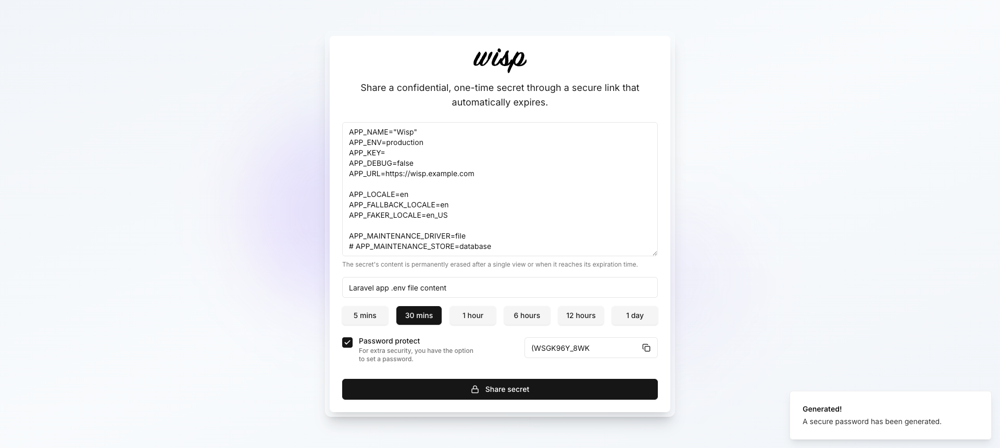
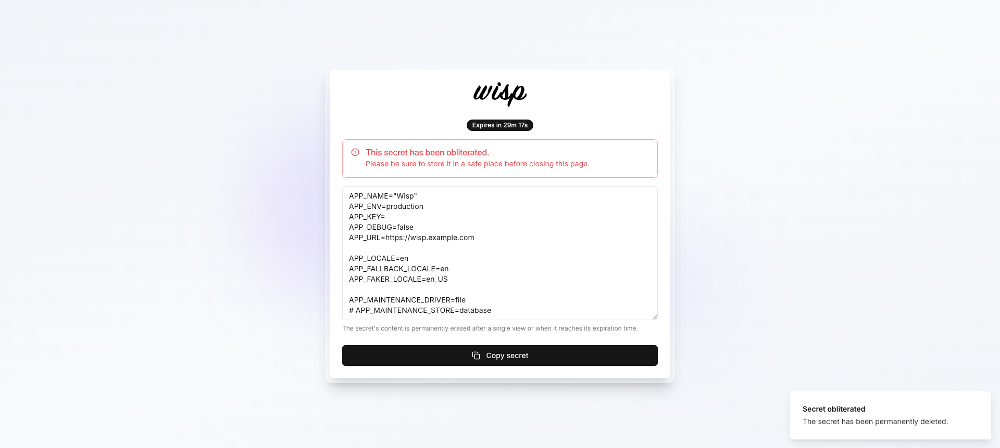

# Wisp - One-Time Secret Sharing Application

[](https://forge.laravel.com/servers/949765/sites/2817705)

Wisp is a secure and straightforward application for sharing encrypted, one-time secrets through a protected link that automatically expires. Once a secret is viewed or reaches its expiration time, it is permanently deleted. For added security, users can set an optional password.

## Screenshots


*Figure 1: Homepage - Create a new secret*


*Figure 2: Generated secure link display*


*Figure 3: Password-protected secret access*


*Figure 4: Secret content display*

## Table of Contents

- [Screenshots](#screenshots)
- [Table of Contents](#table-of-contents)
- [Features](#features)
- [Technologies Used](#technologies-used)
- [Requirements](#requirements)
- [Installation](#installation)
- [Configuration](#configuration)
- [Database Migrations](#database-migrations)
- [Usage](#usage)
  - [Creating a Secret](#creating-a-secret)
  - [Accessing a Secret](#accessing-a-secret)
- [Testing](#testing)
  - [Run Feature Tests](#run-feature-tests)
  - [Run Frontend Tests](#run-frontend-tests)
  - [Run End-to-End Tests (Nightwatch)](#run-end-to-end-tests-nightwatch)
- [Project Structure](#project-structure)
- [Security Considerations](#security-considerations)
- [Contributing](#contributing)
- [License](#license)

## Features

- **Secure Secret Sharing:** Share encrypted, one-time secrets via secure links
- **Password Protection:** Optional password protection for shared secrets
- **Auto-Expiration:** Automatic expiration and deletion of secrets after a single view or expiration time
- **Flexible Timeouts:** Customizable expiration times ranging from minutes to days
- **Modern UI:** User-friendly interface built with Vue 3 and Tailwind CSS
- **Real-time Updates:** Seamless single-page application experience with Inertia.js
- **Secure Backend:** Laravel encryption and hashing for maximum security
- **One-Time Access:** Secrets are permanently destroyed after viewing or manual obliteration
- **Type Safety:** Full TypeScript support for enhanced development experience

## Technologies Used

- **Backend:** Laravel 12.21, PHP 8.4
- **Frontend:** Vue 3.5, Inertia.js 2.0, TypeScript
- **Database:** MySQL
- **Styling:** Tailwind CSS 3.4, shadcn/ui components
- **Routing:** Ziggy (Laravel route helpers for JavaScript)
- **Code Quality:** Laravel Pint (PHP code style fixer)
- **Testing:** PHPUnit, Laravel Nightwatch (E2E testing)
- **Security:** Laravel Encryption, Hashing, HTTPS
- **Hosting:** Heroku
- **JavaScript Runtime:** NodeJS v22

## Requirements

- PHP 8.4 or higher
- Composer
- Node.js v22 and npm
- MySQL 8.0+ or MariaDB 10.3+
- OpenSSL for encryption
- Nginx or Apache server

## Installation

1. **Clone the repository:**

   ```bash
   git clone https://github.com/Thavarshan/wisp.git
   cd wisp
   ```

2. **Install PHP dependencies:**

   ```bash
   composer install
   ```

3. **Install Node dependencies:**

   ```bash
   npm install
   ```

4. **Compile front-end assets:**

   ```bash
   npm run build
   ```

5. **For development, you can run the dev server:**

   ```bash
   npm run dev
   ```

## Configuration

1. **Copy `.env` file:**

   ```bash
   cp .env.example .env
   ```

2. **Configure database in `.env`:**

   ```env
   DB_CONNECTION=mysql
   DB_HOST=127.0.0.1
   DB_PORT=3306
   DB_DATABASE=wisp
   DB_USERNAME=your_username
   DB_PASSWORD=your_password
   ```

3. **Generate application key:**

   ```bash
   php artisan key:generate
   ```

4. **Configure encryption settings in `.env`:**

   ```env
   APP_KEY=base64:your_generated_key
   APP_CIPHER=AES-256-CBC
   ```

## Database Migrations

Run the following command to create database tables:

```bash
php artisan migrate
```

## Usage

### Creating a Secret

1. Visit the homepage and fill out the form:
   - Secret content
   - Optional name
   - Expiration time
   - Optional password

2. Click "Store Secret" to generate a secure link.

### Accessing a Secret

1. Use the provided secure link to access the secret.
2. Enter the password if the secret is password-protected.
3. The secret will be destroyed upon viewing.

## Testing

### Run Feature Tests

```bash
php artisan test
```

### Run Frontend Tests

```bash
npm run test
```

### Run End-to-End Tests (Nightwatch)

```bash
npm run nightwatch
```

## Project Structure

```text
wisp/
├── app/
│   ├── Http/
│   │   ├── Controllers/
│   │   ├── Requests/
│   ├── Models/
├── resources/
│   ├── js/
│   │   ├── components/
│   │   ├── pages/
│   │   ├── utils/
│   ├── views/
├── routes/
│   ├── web.php
├── tests/
│   ├── Feature/
│   ├── Unit/
├── .env.example
├── package.json
├── composer.json
└── README.md
```

## Security Considerations

- **Encryption:** Secrets are encrypted using Laravel's AES-256-CBC encryption.
- **Password Protection:** Passwords are hashed using Bcrypt.
- **HTTPS:** Ensure HTTPS is enabled for secure communication.
- **Auto-deletion:** Secrets are automatically deleted after viewing or expiration.

## Contributing

1. Fork the repository.
2. Create a new branch:

   ```bash
   git checkout -b feature/your-feature-name
   ```

3. Commit your changes:

   ```bash
   git commit -m "Add your message here"
   ```

4. Push to the branch:

   ```bash
   git push origin feature/your-feature-name
   ```

5. Create a Pull Request.

## License

This project is licensed under the MIT License - see the [LICENSE](LICENSE) file for details.

For any issues, please open an issue on GitHub. Thank you for using Wisp!
